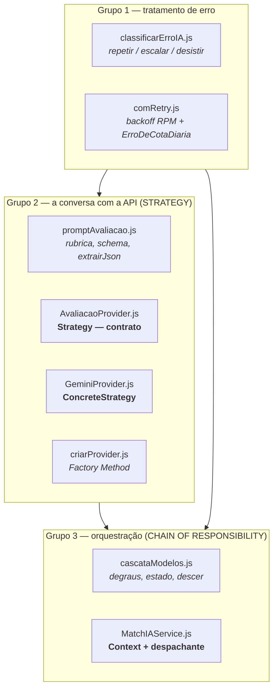
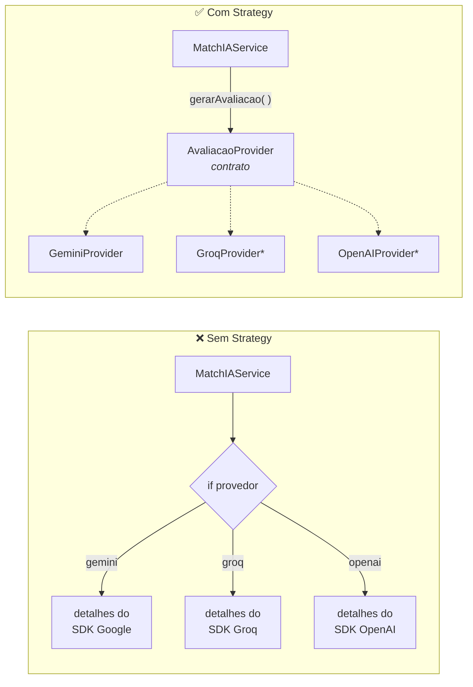
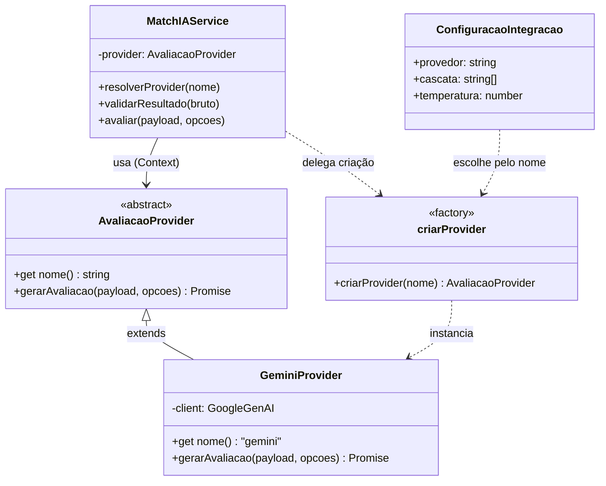
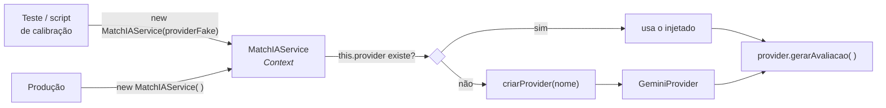
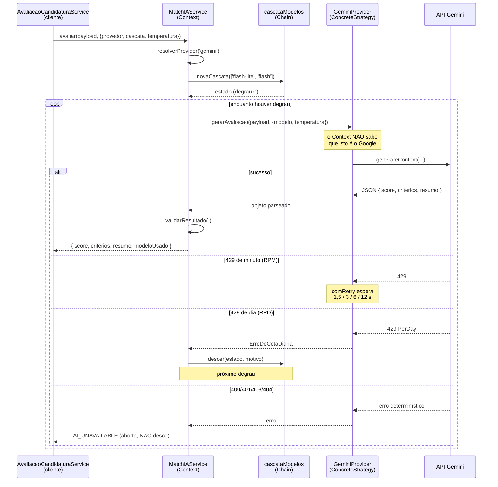
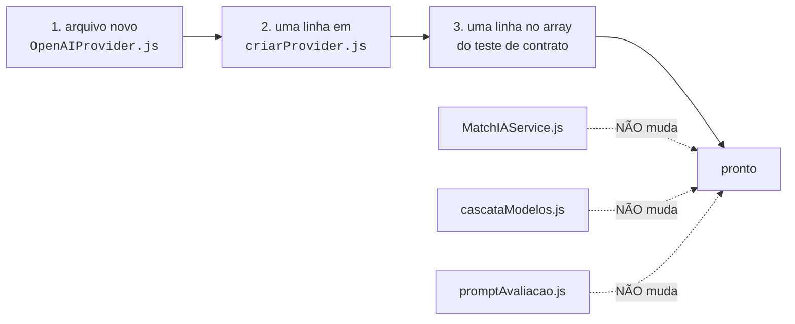
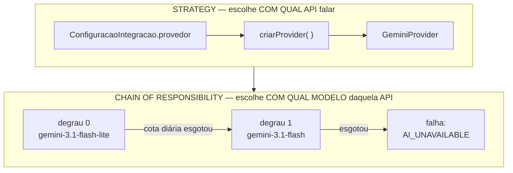
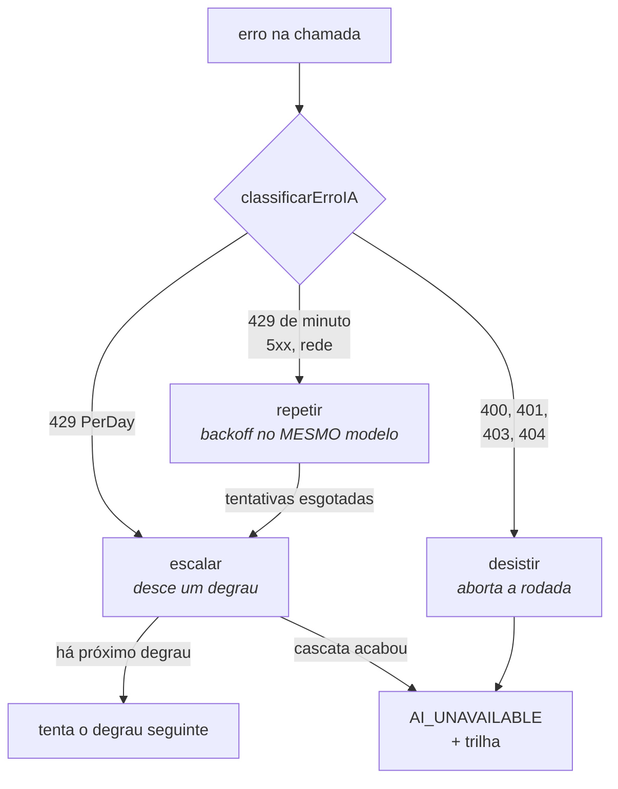

# Strategy na avaliação por IA

> Documentação de projeto da Task 10 do plano `2026-08-04-triagem-ia-candidaturas.md`.
> Explica o padrão **Strategy** como implementado em `src/service/match/`, e onde ele
> termina e o **Chain of Responsibility** começa.

---

## 1. O que a Task 10 entregou

A Task 10 criou a camada que fala com o LLM. Antes dela o sistema já sabia montar o payload
(vaga + currículo + respostas do questionário) e aplicar o gate determinístico de critérios
obrigatórios. Faltava a parte que efetivamente pergunta ao modelo *"esse candidato serve?"*.

Nove arquivos novos, em três grupos:



O grupo 1 existe porque a camada gratuita do Gemini devolve `429` com facilidade, e `429`
significa **duas coisas diferentes**: "você passou do limite deste minuto" (resolve esperando
2 segundos) e "você passou do limite de hoje" (só resolve amanhã). Tratar os dois igual é o
pior dos mundos — o backoff gasta 22,5 s para receber quatro vezes o mesmo erro enquanto o
degrau seguinte estava livre.

O grupo 2 é onde mora o Strategy. O grupo 3 é quem o consome.

**33 testes, nenhum toca a rede.**

---

## 2. O problema que o Strategy resolve

Suponha o `MatchIAService` escrito do jeito ingênuo:

```js
async avaliar(payload, { provedor, modelo }) {
  if (provedor === 'gemini') {
    const client = new GoogleGenAI({ apiKey: process.env.GEMINI_API_KEY });
    const r = await client.models.generateContent({ model: modelo, contents: ..., config: {...} });
    return JSON.parse(r.text);
  }
  if (provedor === 'groq') {
    const client = new Groq({ apiKey: process.env.GROQ_API_KEY });
    const r = await client.chat.completions.create({ model: modelo, messages: [...] });
    return JSON.parse(r.choices[0].message.content);
  }
  // e amanhã: if (provedor === 'openai') ...
}
```

Funciona. E tem três defeitos que só aparecem depois:

| Defeito | Consequência prática |
|---|---|
| Toda API nova mexe **neste** arquivo | O arquivo que já hospeda o laço da cascata e a validação do resultado ganha mais um `if` no meio |
| Testar exige rede | Não dá para exercitar o laço da cascata sem instanciar um cliente HTTP de verdade |
| O arquivo sabe demais | Conhece o campo `contents` do Google e o `choices[0].message.content` do Groq — detalhes alheios à decisão que ele deveria tomar |

### A ideia do padrão

> Quando várias coisas resolvem **o mesmo problema de jeitos diferentes**, dê a todas a
> **mesma assinatura**, coloque cada uma na sua própria classe, e faça quem as usa depender
> só da assinatura.

Visualmente, a diferença é esta:



<sub>* não existem hoje — o desenho apenas mostra onde entrariam.</sub>

No desenho da direita, o `MatchIAService` tem **uma seta só**. Ele não enxerga as caixas
pontilhadas.

---

## 3. Os três papéis do padrão

Strategy sempre tem exatamente três papéis:

| Papel | O que é | Neste projeto |
|---|---|---|
| **Strategy** | O contrato. Diz qual método existe, o que recebe e o que devolve | `src/service/match/AvaliacaoProvider.js` |
| **ConcreteStrategy** | Uma implementação concreta do contrato | `src/service/match/GeminiProvider.js` |
| **Context** | Quem usa uma estratégia **sem saber qual é** | `src/service/MatchIAService.js` |

### ⚠️ O ponto que costuma confundir

**O Strategy não está *dentro* do `MatchIAService`.** O `MatchIAService` é o **Context** — o
cliente do padrão, não uma das estratégias.

A formulação correta para a defesa:

> O `MatchIAService` é o *Context* do Strategy. Ele **consome** a estratégia; não é uma delas.

O padrão em si mora no par `AvaliacaoProvider` (contrato) + `GeminiProvider` (implementação).

### Diagrama de classes



Leia as setas assim:

- **`AvaliacaoProvider <|-- GeminiProvider`** — herança. O provedor concreto *é um*
  `AvaliacaoProvider`.
- **`MatchIAService --> AvaliacaoProvider`** — a única dependência do Context é o **contrato**.
  Nunca a classe concreta.
- **`criarProvider ..> GeminiProvider`** — a fábrica é o único lugar do sistema que menciona
  `GeminiProvider` pelo nome.

---

## 4. O contrato (Strategy)

```js
// src/service/match/AvaliacaoProvider.js
class AvaliacaoProvider {
  get nome() {
    throw new AppError(`${this.constructor.name}: getter 'nome' nao implementado.`, ...);
  }

  async gerarAvaliacao(payload, { modelo, temperatura }) {
    throw new AppError(`${this.constructor.name}: gerarAvaliacao nao implementado.`, ...);
  }
}
```

Repare: a classe **não faz nada**. Só declara que toda estratégia de avaliação tem um `nome`
e um `gerarAvaliacao(payload, { modelo, temperatura })`. Os `throw` são o mecanismo que
denuncia quem herdar e esquecer de implementar.

Em Java ou C# isso seria `interface AvaliacaoProvider`. JavaScript não tem `interface`, então
usamos uma classe abstrata por convenção.

> **Limitação honesta, para a monografia:** o contrato só falha em *tempo de execução*, não em
> compilação. É por isso que existe o teste do Step 6a — ele verifica o contrato
> explicitamente, fazendo o papel que a linguagem não faz.

```js
// src/test/integration/matchIA.test.js — o teste que substitui a interface
const estrategias = [['gemini', GeminiProvider]];

it.each(estrategias)('%s cumpre o contrato', (nome, Estrategia) => {
  const provider = new Estrategia({});
  expect(provider).toBeInstanceOf(AvaliacaoProvider);
  expect(provider.nome).toBe(nome);
  expect(typeof provider.gerarAvaliacao).toBe('function');
  expect(provider.gerarAvaliacao).not.toBe(AvaliacaoProvider.prototype.gerarAvaliacao);
});
```

A lista é percorrida em vez de testada classe a classe: um provedor futuro entra nesta
verificação **de graça**, bastando somar uma linha ao array.

---

## 5. A implementação concreta (ConcreteStrategy)

```js
// src/service/match/GeminiProvider.js
class GeminiProvider extends AvaliacaoProvider {
  get nome() { return 'gemini'; }

  async gerarAvaliacao(payload, { modelo, temperatura }) {
    const response = await comRetry(
      () => this.client.models.generateContent({ /* jeito do Google */ }),
      { modelo },
    );
    return extrairJson(response.text);
  }
}
```

Tudo que é específico do Google — o nome dos campos, o formato da resposta, o `response.text` —
está **preso dentro desta classe**. Nada disso vaza para cima.

---

## 6. Como o Context usa a estratégia

A linha decisiva do `MatchIAService`, em `src/service/MatchIAService.js:65`:

```js
const bruto = await provider.gerarAvaliacao(payload, { modelo, temperatura });
```

Uma linha. **Não há `if (provedor === 'gemini')` em lugar nenhum do arquivo** — pode conferir.
O `MatchIAService` sabe que existe *algum* objeto com um método `gerarAvaliacao`, e não sabe
(nem quer saber) se por trás dele há Google, Groq ou um mock de teste.

E como ele obtém a estratégia:

```js
resolverProvider(nome) {
  return this.provider || criarProvider(nome);
}
```

Duas portas de entrada:



- **`this.provider`** — injetado pelo construtor. É por aqui que os **testes** entram,
  passando um `jest.fn()`.
- **`criarProvider(nome)`** — a fábrica, usada em produção, que traduz `'gemini'` na classe
  concreta.

### Sequência completa de uma avaliação



---

## 7. Por que isso paga

Três ganhos verificáveis, não estéticos.

### 7.1 Os testes não tocam a rede

O ganho mais concreto e o mais fácil de demonstrar:

```js
const gerarAvaliacao = jest.fn().mockResolvedValue({ score: 0.8, criterios: [], resumo: 'ok' });
const service = new MatchIAService({ gerarAvaliacao });
```

Um objeto literal com um método. Ele **não herda** de `AvaliacaoProvider`, não tem chave de
API, não abre socket — e o `MatchIAService` funciona com ele exatamente igual. Foi assim que
os 15 testes de `matchIA.test.js` fixaram o comportamento da cascata **sem gastar uma
requisição de cota**.

### 7.2 A cascata fica agnóstica

O laço `while (!acabou(estado))` funciona com qualquer provedor porque só conhece o contrato.
Sem o Strategy, esse laço estaria amarrado ao formato do SDK do Google, e um segundo provedor
exigiria reescrevê-lo.

### 7.3 Extensão sem modificação (OCP)

Acrescentar um provedor:



Nenhum arquivo existente muda de comportamento. Isso é o **OCP** (*Open/Closed Principle*) —
aberto para extensão, fechado para modificação.

---

## 8. A objeção que a banca vai fazer

> *"Você tem uma família de uma estratégia só. Isso ainda é Strategy, ou é abstração
> prematura?"*

A pergunta é legítima. O Groq saiu da aplicação no D06 (alucinação maior que a do Gemini nos
testes de texto livre, saída estruturada apenas *best-effort*, `strict mode` indisponível no
modelo em uso), e hoje `GeminiProvider` é a única `ConcreteStrategy`.

Três respostas, todas verificáveis:

1. **É o contrato que mantém a cascata agnóstica.** Sem ele, o laço de degraus ficaria
   acoplado ao formato do SDK do Google.
2. **O ponto de extensão é real, não hipotético.** O Groq **esteve** lá e saiu — e a saída
   dele não quebrou o `MatchIAService`. Isso é evidência de desacoplamento funcionando, não
   promessa.
3. **Testabilidade.** Os 15 testes offline do Context só existem porque a estratégia é
   injetável.

### Por que Strategy e não outro padrão

| Padrão alternativo | Por que não serve aqui |
|---|---|
| **Adapter** | Também envolve API externa, mas seu objetivo é compatibilizar uma interface que **você não controla** com uma que já existe. Aqui a interface-alvo é sua e foi desenhada para o caso |
| **Template Method** | Fixaria o esqueleto do algoritmo numa superclasse com ganchos sobrescritos. Provedores diferentes não compartilham esqueleto — só assinatura e formato de retorno |
| **Factory Method** | Aparece de fato em `criarProvider.js`, mas é **coadjuvante**: resolve *como instanciar* a estratégia, não *como variar o comportamento* |

---

## 9. Os dois padrões empilhados — não confundir

O projeto tem **dois** padrões comportamentais do GoF, em camadas, porque há **duas**
variações independentes a isolar.



| | **Strategy** | **Chain of Responsibility** |
|---|---|---|
| **Varia o quê** | *Qual API* — Gemini, Groq, OpenAI | *Qual modelo* — `flash-lite`, `flash` |
| **Quem escolhe** | A configuração, **antes** da chamada | O estado da cota, **durante** a chamada |
| **Arquivos** | `AvaliacaoProvider` + `GeminiProvider` | `cascataModelos.js` + o laço do Context |
| **Momento** | Estático por requisição | Emerge em tempo de execução |

**Frase-resumo:** *provedor novo não é degrau novo, e modelo esgotado não é provedor trocado.*

O `MatchIAService` acumula **dois papéis**: é o *Context* do Strategy **e** o despachante da
Chain. Por isso o comentário no topo do arquivo diz as duas coisas.

### A decisão que a Chain torna operacional



Duas regras que o desenho impõe, e que os testes fixam:

1. **Backoff primeiro, degrau depois.** Descer no primeiro `429` queimaria a reserva por um
   bloqueio que passaria sozinho em 1,5 s.
2. **Erro determinístico aborta, não desce.** `400` (payload inválido), `401` (chave errada),
   `403` e `404` (ID de modelo inexistente) vão falhar igual no degrau seguinte. Descer
   transformaria *"seu schema está errado"* em *"todos os modelos falharam"* — o relatório
   mais inútil possível.

---

## 10. Limitação honesta a registrar

1. **JavaScript não tem interface de linguagem.** A classe base do Strategy é convenção que só
   falha em tempo de execução. O teste do Step 6a dá ao contrato a garantia que a linguagem não
   dá.
2. **A cascata pressupõe cotas independentes por modelo.** Se a camada gratuita contar RPD por
   *projeto* em vez de por *modelo*, descer de degrau não recupera nada e o padrão vira
   estrutura sem efeito. Isso é **medível antes de confiar**, e a Task 18 mede.

---

## Índice de arquivos

| Arquivo | Papel |
|---|---|
| `src/service/match/AvaliacaoProvider.js` | **Strategy** — contrato abstrato |
| `src/service/match/GeminiProvider.js` | **ConcreteStrategy** — adaptador do `@google/genai` |
| `src/service/match/criarProvider.js` | **Factory Method** — nome → estratégia concreta |
| `src/service/match/promptAvaliacao.js` | Rubrica, schema e mensagem — compartilhados |
| `src/service/match/cascataModelos.js` | **Chain of Responsibility** — degraus e estado |
| `src/service/MatchIAService.js` | **Context** + despachante da cascata |
| `src/utils/helpers/classificarErroIA.js` | `repetir` / `escalar` / `desistir` |
| `src/utils/helpers/comRetry.js` | Backoff de RPM + `ErroDeCotaDiaria` |
| `scripts/fumaca.js` | Teste de fumaça contra a API real (Step 13) |
